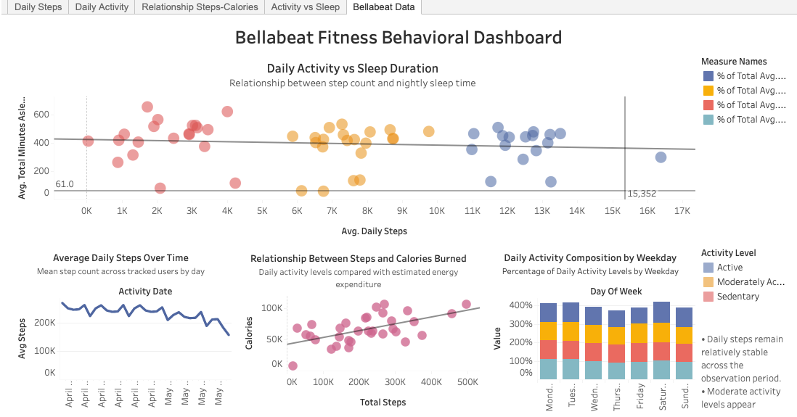

# Bellabeat Fitness Data Analysis

**Capstone Project | Google Data Analytics Certificate**  
**Tools:** Python, Pandas, Tableau, MS Power Point  
**Focus:** Smart device usage trends, behavioral analysis, marketing insights

## Project Overview
As part of the Google Data Analytics Certificate Capstone, this project analyzes smart device usage data to identify behavioral trends and generate marketing insights for the Bellabeat Leaf wellness product.

## Navigation
- [Project Overview](#project-overview)
- [Business Task](#business-task)
- [Dataset](#dataset)
- [Tools Used](#tools-used)
- [Data Analysis Process](#data-analysis-process)
- [Dashboard](#dashboard)
- [Key Insights](#key-insights)
- [Recommendations](#recommendations)

---

## Business Task

Bellabeat, a high-tech wellness company, wants to understand how consumers use smart fitness devices.  
The objective of this analysis is to identify behavioral trends that can inform marketing strategies for the Bellabeat Leaf product.

---

## Dataset

The dataset contains smart device fitness tracking data, including:

- Daily steps
- Activity intensity
- Calories burned
- Sleep patterns

The data was processed and analyzed to identify patterns in user activity behavior.

---

## Tools Used

- **Python (Pandas)** — data cleaning and aggregation  
- **Excel / CSV** — dataset preparation  
- **Tableau** — visualization and dashboard creation  

---

## Data Analysis Process

1. Imported raw fitness tracking data
2. Cleaned and standardized datasets
3. Aggregated activity metrics
4. Analyzed behavioral patterns
5. Built visualization dashboard

---

## Dashboard

Interactive Tableau dashboard:

[View the Tableau Dashboard](https://public.tableau.com/views/Capstone_Data_Analyst_Google/Dashboard1)

---

## Key Insights

Key patterns identified during the analysis include:

- Activity levels remain relatively consistent throughout the week.
- Peak activity periods align with typical daytime hours.
- Users show varying levels of engagement with fitness tracking features.

---

## Recommendations

Based on the analysis:

- Marketing campaigns should emphasize **daily activity tracking features**.
- Engagement strategies could focus on **encouraging consistent activity habits**.
- Bellabeat may benefit from highlighting **habit-forming wellness features** in its messaging.

## Data Source

The dataset used in this analysis was provided via Kaggle as part of the Bellabeat case study.  
[View FitBit Fitness Tracker Data Here](https://www.kaggle.com/datasets/arashnic/fitbit)
